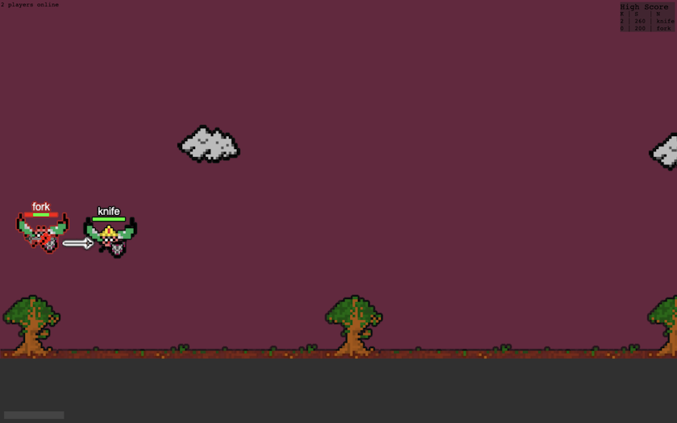

# Stabby Flies

Multiplayer Browser Game in Elixir/Phoenix

## To-Do

- Handle disconnect properly
- Render player names
- Get deployment working! There's some sort of strange bug.
- Currently a players name to uniquely identify them when it should be a socket id or something of the sort
- Write tests...

## Installation

  * `mix deps.get` (Install dependencies)
  * `mix ecto.create && mix ecto.migrate` (Create &)
  * Install Node.js dependencies with `cd assets && npm install`
  * Start Phoenix endpoint with `mix phx.server`
  * Test with `MIX_ENV=test mix do coveralls.json`

Now you can visit [`localhost:4000`](http://localhost:4000) from your browser.
